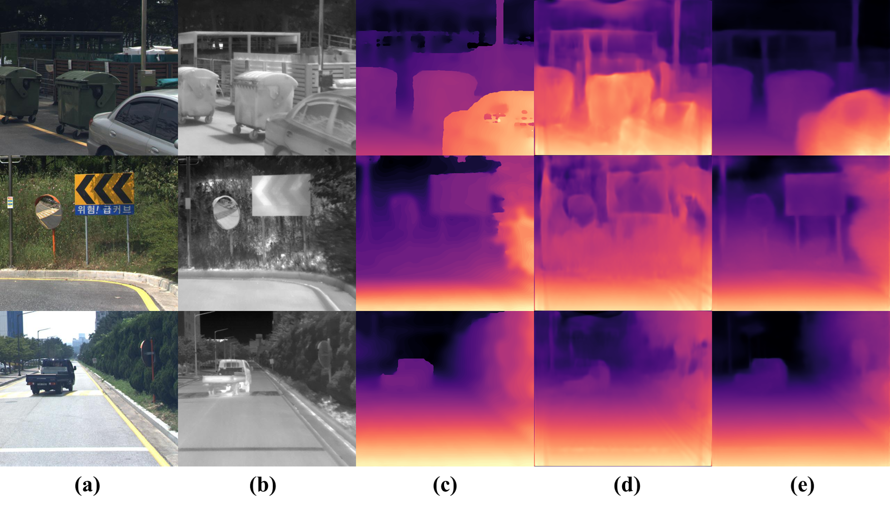

# Pseudo-Lidar

## Dataset

### KAIST TITS 2018

실험한 알고리즘은 학습 시에는 Stereo-pair images와 테스트 시에는 single image가 필요하다.
학습과 테스트는  KAIST TITS 2018 데이터 셋을 사용했다.
학습에는 3037 장,테스트에는 1784 장이 포함되어있다. 

## Dataloader
Dataloader는 폴더의 다음 구조를 가정합니다 ("data_dir" 에는 Kaist_data이 들어가야한다.)
왼쪽 영상의 경우 LEFT 폴더 속에있고 , 오른쪽 영상의 경우 RIGTH에 있으니 찾기 쉬울 것이다. <b>그리고 데이터를 불러오기 위한 txt 파일은 Kaist에서 제공되는 것이 아니니 ```cp``` 나 ```mv```를 이용해 txt를 옳겨줘야한다.</b>

예 ) 데이터 폴더 구조 (이 예에서는 "Kaist_data" 디렉토리 경로를 'data_dir' 로 전달해야 한다 ) :
```
data
├── Kaist_data
│   ├── training
│   │   ├── Campus
│   │   │   ├─ DEPTH
│   │   │   │   ├── DEPTH_000000000.mat
│   │   │   │   └── ...
│   │   │   ├─ LEFT
│   │   │   │   ├── LEFT_000000000.jpg
│   │   │   │   └── ...
│   │   │   ├─ RIGTH
│   │   │   │   ├── RIGHT_000000000.jpg
│   │   │   │   └── ...
│   │   │   ├─ THERMAL
│   │   │   │   ├── THERMAL_000000000.jpg
│   │   │   │   └── ...
│   │   ├── Urban
│   │   │   ├── DEPTH
│   │   │   │   ├── DEPTH_000000000.mat
│   │   │   │   └── ...
│   │   │   └── ...
│   │   └── ...
│   ├── testing
│   │   ├── Campus
│   │   │   ├─ DEPTH
│   │   │   └── ...
│   │   └── ...
│   ├── txt
│   │   ├── train.txt
│   │   ├── test.txt
│   │   ├── test_depth.txt
│   └── ...
├── models
├── output

```

## train
- 학습하기 위한 간단한 실행 명령어는 start2train.sh 에 있으며, 데이터 경로를 맞춰주고 start2train.sh을 실행 시켜주면 학습이 될 것이다.
   - 이 경우 Self-Guided loss를 사용한다.  
```
bash start2train.sh
```


## test
테스트 argument는 학습과 동일하며 테스트 하기 위한 실행 명령어는 eval.sh 에 있으니 그것을 실행 시키면 된다.

```
bash eval.sh
```

### Requirements
This code was tested with PyTorch 0.4.1, CUDA 9.1 and Ubuntu 16.04. Other required modules:

```
torchvision
numpy
matplotlib
```


## 정량적 평가

- 추정된 깊이 정보의 성능 평가를 위해 성능평가지표(evaluation metric)로 RMSE(Root Mean Squre Error)와 RMLSE((Root Mean Squre Logarithmic Error)를 사용 하였음
⦁일반적으로 깊이 정보의 성능 평가를 위해 최대 깊이 정보를 50m 혹은 80m 로 제한하고 있음. 아래의 실험에서는 50(m)를 최대 깊이 정보로 설정하여 GT정보 기준 0~50m 만 성능 평가 대상으로 함. 

- 열화상 영상을 이용한 깊이 추정 방법(Pseudo-Lidar)의 베이스라인 성능을 측정하기 위해 칼라 영상(RGB)과 열화상영상(Thermal) 각각을 깊이 추정 모델의 입력 영상으로 사용하여 추정된 깊이 정보의 정확도를 분석함. 분석 결과 입력 영상에 따른 정량적 성능 차이가 있는 것으로 판단됨.  

| model |  입력영상| RMSE <50| RMLSE<50m | 
|:-----: | :-----:|:-----: |:-----: |
| Monodepth2 |   칼라  |  3.082 |  0.1267  |
| Monodepth2 |   열화상 |  3.484 |  0.1420 |

- 본 연구진은 더욱 정확한 시맨틱 정보와 공간 정보가 포함된 깊이 정보를 예측하기 위해 깊이 추정 네트워크로 ㉠(DIFFNet)을 베이스라인에 적용함.
- 또한, 베이스라인 방법론에 사용되는 단일 깊이 추정 모델에서 예측된 깊이 정보를 후보정하기 위해 멀티모델을 사용해 점진적으로 깊이 정보를 보정하는 ㉡(GBNet)을 사용함.
- 정량적 결과(RMSE,RMLSE)를 살펴보면, ㉠(DIFFNet)과 ㉡(GBNet)을 각각 베이스라인 방법론에 적용했을 때 성능 향상이 있음을 확인할 수 있으며 두 가지 방법론을 함께 사용하는 것이 가장 우수한 성능을 보였음.

| model |  입력영상| RMSE <50m | RMLSE<50m | 
|:-----: | :-----:|:-----: |:-----: |
| Monodepth2 |   칼라  |  3.082 |  0.1267  | 
| Monodepth2+㉠ |   칼라 |  2.923 |  0.1188 |
| Monodepth2+㉡ |   칼라  |  2.977 | 0.1255 |  
| Monodepth2+㉠+㉡ |   칼라 |  *2.918* |  *0.1163* | 

- 본 연구진은 열화상 영상을 이용한 깊이 추정 성능과 칼라 영상을 이용한 깊이 추정 성능 차이를 줄이기 위해 칼라 영상을 이용해 얻은 깊이 영상을 Pseudo-Label로 사용하는 ㉢(Self Guided Framework)를 설계함. 
- 아래의 실험 결과는 본 연구진이 설계한 ㉢(Self Guided Framework)가 열화상 영상을 이용한 깊이 추정 성능과 칼라 영상을 이용한 깊이 추정 성능 차이를 효과적으로 줄이는 것을 증명함. 

| model |  입력영상| RMSE <50m | RMLSE<50m | 
|:-----: | :-----:|:-----: |:-----: |
| Monodepth2+㉠+㉡ |   칼라 |  2.918 |  0.1163 |
| Monodepth2+㉠+㉡ |   열화상  |  3.587 | 0.1396 |  
| Monodepth2+㉠+㉡+㉢ |  열화상 |  *3.317* |  *0.1206* | 

## 정성적 평가
- 아래 그림의 정성적 결과인 (d)와 (e)를 비교해보면, 본 연구진이 제안한 시맨틱 정보를 활용한 깊이 보정 연구인 (e)가 물체를 더욱 정확하게 예측하며 노이즈가 없는 결과를 확인할 수 있음. 


 시맨틱 정보를 활용하여 생성된 깊이 영상 보정 연구의 정성적 결과 (a) 칼라영상, (b) 열화상영상, (c) 정답 Disparity 영상, (d) 열화상영상을 이용한 1차년도 베이스라인 방법론 결과 (e) 열화상영상을 이용한 깊이 보정 연구(Monodepth2+㉠+㉡+㉢) 결과


