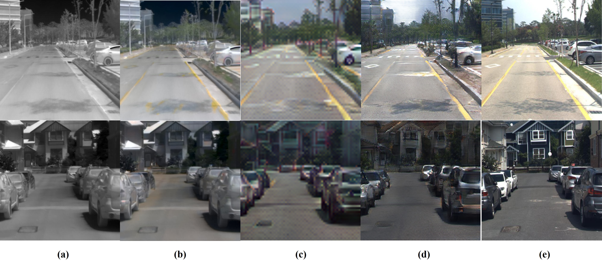
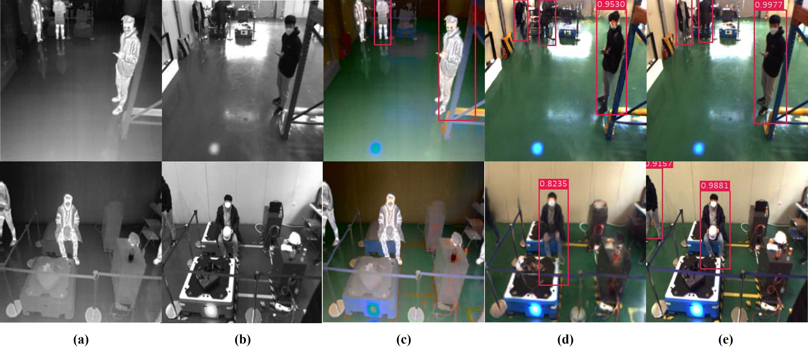

# Pseudo-RGB
- 주야간 관계없이 사용 가능한 Pseudo-RGB 기술 개발을 위해 시작된 연구로, Colorization 모델을 이용해 열화상 영상을 컬러 영상으로 변환하고자 한다.
- 기존 Colorization의 경우 영상 전체를 입력으로 하여 영상을 colorization하고자 하였으나, 이는 다수의 물체가 나오거나 물체와 배경이 뚜렷하지 않을 경우, 물체에 대한 색상이 선명치 못하고 배경색에 덮혀버리는 문제가 발생한다. 이를 해결하고자 영상 내 각 물체에 대해서 Colorization하는 방법론이 제안되었으며, 해당 방법론을 이번 연구에 베이스로 설정하였다. Instance aware Image Colorization은 총 3개의 네트워크로 구성되어 있으며, 각각 전체 영상, 물체 영역 영상, 전체와 물체 영역을 fusion한 영상을 입력으로 한다. 실험 결과는 아래에서 확인 가능하다.

debuging : $${\alpha}$$, $$\frac{1}{3}$$, $$Thermal<u>RGB</u>$$ $$T~RGB~$$

## Dataloader

데이터는 아래 구조와 같이 구성되어야만 한다.

```
datas
├── train
│   ├─ RGB
│   │   ├── LEFT_000000000.jpg
│   │   └── ...
│   ├─ THER
│   │   ├── THER_000000000.jpg
│   │   └── ...
├── test
│   ├─ RGB
│   │   ├── LEFT_000000000.jpg
│   │   └── ...
│   ├─ THER
│   │   ├── THER_000000000.jpg
│   │   └── ...
```

이때 RGB의 영상명이 LEFT로 되어있는데, 이는 KAIST DATASET에서 제공되는 left RGB을 사용하기 때문이므로, 파일이름은 크게 신경 쓸 필요가 없다.


--train argument를 추가 시 train data만을 불러오며, train argmuent를 제외하면 test data를 불러온다.
## Install other dependencies & Download pretrained model
코드를 실행시키기 위한 필요 라이브러리는 아래 코드를 통해 설치할 수 있다.
```
pip install -r requirements.txt
```
Generator로 사용하는 HRFormer-T의 imagenet pretrained weight는 [해당링크](https://onedrive.live.com/?authkey=%21ABcYHrd0FVU64s4&cid=F03BAC62B7168F2F&id=F03BAC62B7168F2F%212005&parId=F03BAC62B7168F2F%212002&o=OneUp)에서 다운받을 수 있으며 다운받은 체크포인트는 pretrained 폴더에 저장한다.

## train

1. 학습에는 train.py 파일을 사용하며 이때 사용되는 주요 argument는 다음과 같다. :
 - `dataroot`: 학습할 데이터 셋이 존재하는 폴더 경로
 - `name`: 실험결과가 저장되는 폴더 이름, 모델의 체크포인트가 해당 폴더에 저장됨
 - `project_name` : Wandb의 프로젝트 이름 설정

 그 외에 다른 argument들은 ./options/train_options.py에서 확인 가능하다.

2. scripts 폴더 내 train.sh 파일을 실행시키면 학습 코드를 실행시킬 수 있다.
```
sh scripts/train.sh
```

## test
학습된 체크포인트들은 "checkpoints" 폴더 내에 존재한다.

아래 명령어를 실행하면 학습된 모델을 이용하여 Fake RGB 영상이 생성되며 이는 새로 생성되는 "results/$MODEL_NAME" 폴더 내에 THERMAL, FAKE RGB, REAL RGB Image들이 각각 저장된다.
```
bash test.sh
```
만일 생성된 결과를 저장하지 않고 정량적인 결과만을 확인하고 싶다면 "test.sh" 쉘 스크립트 내 "--save_result" 옵션을 제거한다.

# 평가
## Dataset
- KAIST Multispectral Dataset
KAIST Multispectral Dataset은 캠퍼스, 도심, 주거지 등 다양한 환경과 낮, 밤에 다양한 시간대에서 촬영된 데이터 셋으로, 쌍을 이루는 컬러 스테레오 영상과 열화상 영상을 제공한다. 모든 영상들은 정합이 이루어져있으며 영상 외에 3D points, annotation 등도 제공하기에 깊이 추정, 보행자 인식, 위치 인식, 컬러 추정 등 다양한 연구 분야에 활용되는 데이터 셋이다.

- Sejong Multispectral Dataset
Sejong Multispectral Dataset은 실내물류창고 내 무인지게차의 장애물 회피 연구를 위한 목적으로 촬영되었다. 촬영에 사용된 시스템은 2대의 컬러 카메라와, 2대의 열화상 카메라로 이루어져있어 쌍을 이루는 컬러 영상과 열화상 영상을 제공한다. 주로 물류창고 내 작업자 위치 인식 연구 분야에 활용된다.

## 평가 메트릭
- PSNR은 영상 복원 측면에서 흔하게 사용되는 평가 메트릭으로, 먼저 PSNR의 경우 생성 또는 복원된 영상의 화질에 대한 손실 정보를 평가한다. 하지만 [Zhang](https://arxiv.org/abs/1801.03924)에 따르면 PSNR은 Mean Absolute Error(MSE)를 기반으로 픽셀 에러만을 고려하기에 선명함과 사실성을 중요하게 여기는 영상 생성, 변환 분야의 평가 메트릭으로 삼기에는 부적합다고 볼 수 있다. 예를 들어 생성된 Fake RGB 영상 속 버스가 초록색이지만, Real RGB 영상 속 버스는 파란색이면 PSNR 평가 메트릭에서는 큰 에러로 나타나게 된다. 이러한 관점에서 해당 연구보고서에서는 PSNR 대신 아래 SSIM과 LPIPS 평가 메트릭을 영상 생성의 중요 평가지표로 활용하고자 한다.
- SSIM은 PSNR에 달리 인간의 시각적 화질 차이를 고려하여 설계된 평가 방법으로, 영상의 휘도, 대비, 구조 3가지 측면에 대하여 품질을 평가한다. SSIM의 경우 값이 100에 가까울수록 영상 복원 및 생성이 잘 되었다고 판단한다.
- LPIPS(Learned Perceptual Image Patch Similarity)란 노이즈, 블러, 압축 등과 같은 전통적인 왜곡 종류와 generator network architecture(layers, skip connection, upsampling method 등), Loss/Learning 등과 같이 CNN 기반의 왜곡등으로 이루어진 데이터 셋을 통하여 영상 패치 기반에 유사성을 학습한 모델로 영상의 복원 정도를 평가하는 메트릭이다. 이 LPIPS는 에러 정도를 측정하는 것이기 때문에 위에 언급한 PSNR과 SSIM과 달리 값이 낮을수록 원본 영상과 차이가 적다는 것을 의미한다.

## Pseudo-RGB Translation 품질 평가
## 정량적 평가
- 칼라(CbCr)만을 추정했던 1차년도와 달리 명도(Y) 정보도 함께 학습하여 최종적으로 RGB 영상($RGB_{Thermal}$)을 추정하는 2차년도에서는 열화상 영상을 이용한 칼라 추정 방법(Pseudo-RGB)의 성능을 측정해보고자 위의 평가지표들을 가지고 생성된 Fake RGB 영상과 Real RGB 영상의 차이를 비교하였다.

- KAIST Multispectral Dataset

| 평가 영상 | 디코더 유무 | PSNR↑| SSIM↑ | LPIPS↓ |
|:-----: | :-----:|:-----:|:-----: |:-----: |
| $Y_{Thermal} + CbCr_{Thermal}$ | O |  27.9761  |  0.4052 |  0.5074 |
| $RGB_{Thermal}$ | X |  27.28.4286  |  0.5288 |  0.4977 |
| $RGB_{Thermal}$ | O | 28.3725 | 0.4824 | 0.4341 |

- Sejong Multispectral Dataset

| 평가 영상 | 디코더 유무 | PSNR↑| SSIM↑ | LPIPS↓ |
|:-----: | :-----:|:-----:|:-----: |:-----: |
| $Y_{Thermal} + CbCr_{Thermal}$ | O |  27.9214  |  0.4422 |  0.5276 |
| $RGB_{Thermal}$ | X |  28.9398  |  0.6302 | 0.5099 |
| $RGB_{Thermal}$ | O | 29.0618 | 0.6209 | 0.4306 |

- 위의 정량적 결과는 ($RGB_{Thermal}$)의 성능이 1차년도 결과인 열화상 영상($Y_{Thermal}$)에 열화상 영상에서 추정된 칼라($CbCr_{Thermal}$)를 입혀 칼라 영상의 품질을 측정한 성능보다 SSIM 기준 향상된 결과를 보여준다.

- PSNR 평가지표의 경우 SSIM만큼 큰 폭으로 향상되지 않았는데, 이는 위의 평가메트릭 설명에서도 언급했다시피 영상의 사실성 보다는 픽셀에러 차이만을 고려하는 평가방식으로 인하여 영상 생성 관점에서는 정확한 평가 지표로 활용하기 어렵기 때문이다.

- 모든 해상도에 대하여 병렬적으로 학습하는 트랜스포머 모델은 구조적 정보를 잘 보완하여 SSIM 수치가 크게 향상되었지만, 빠른 연산속도를 얻고자 원본 해상도의 4배 작은 결과를 생성하기에 생성된 결과의 선명도가 다소 저하되어 1차년도 대비 LPIPS 성능은 미미하게 향상됐다. (SSIM : 0.4052 → 0.5288, LPIPS : 0.5074 → 0.4977)

- 위의 실험 결과를 바탕으로 트랜스포머 모델에 디코더를 추가하여 보다 선명한 ($RGB_{Thermal}$)를 생성하였으며, 이를 통해 LPIPS의 성능은 디코더를 추가하기 이전에 비해 크게 향상되었지만, SSIM 성능은 일부 감소됨을 확인하였다.

- 이는 디코더가 생성된 결과를 점진적으로 보간(Interpolation)함으로써 영상의 선명도는 향상되었지만, 그 과정에서 영상의 구조적 성분들을 온전히 표현하지 못하고 손상된 것으로 판단된다.
### 정성적 결과
 다중 해상도 특징 맵 기반 RGB 추정 모델의 정성적 평가 결과. 1행과 2행은 각각 KAIST 멀티스펙트럴 데이터 셋의 Campus와 Urban에 대한 정성적 결과 예시이며, (a) Thermal (b) ($Y_{Thermal}+CbCr_{Thermal}$) (c) ($RGB_{Thermal} w/o Decoder$) (d) ($RGB_{Thermal} w/ decoder$) (e) Real RGB에 해당함.

- 그림1-(b)에서 볼 수 있듯이 칼라 정보만을 추정한 1차년도 결과는 열화상 밝기에 ($Y_{Thermal}$)에 영향을 받아 색상을 뚜렷하게 표현 못 하지만, 명도 정보를 함께 예측한 그림1-(c),(d)는 비교적 RGB 영상과 유사하게 칼라 정보가 생성되는 것으로 보인다.

- 그림1-(c)는 (d)와 비교하였을 때 디코더의 부재로 선명도가 다소 감소한 결과를 확인할 수 있으나, 전체적인 장면의 구조 및 칼라 정보는 잘 생성한 것으로 볼 때, 추후 성능 향상을 위해서는 구조적 정보의 왜곡 없이 사실적으로 보간을 수행하는 초해상도(Super Resolution) 기술 연구 방향으로 진행되어야 한다고 판단된다.

## Detection 검출 성능 평가
### 정량적 결과
- Sejong 멀티스펙트럴 데이터셋을 이용한 보행자 인식률은 아래와 같으며, RGB 영상으로 학습된 SSD(Single Shot Detector)의 사전학습 모델을 이용하여 평가를 진행하였다.
- 이 때, 4배 더 적은 해상도를 출력하는 Transformer 모델의 특성으로 인한 결과 해상도의 차이가 ($RGB_{Thermal}$)의 품질 측정에 영향을 끼치는 것을 방지하고자 디코더가 추가된 트랜스포머 모델의 결과로 검출 성능을 평가함.

|  | RGB| $RGB_{Thermal}$ | $Y_{Thermal}+CbCr_{Thermal}$ | Grey | Thermal |
|:-----: | :-----:|:-----: |:-----: |:-----: | :-----: |
| mAP(%) | 95.46 |  77.55 | 62.01 | 62.81 | 24.61 |

- 위의 정량적 결과에 의하면 명도 정보와 칼라 정보를 동시에 추정한 ($RGB_{Thermal}$)의 성능이 일부 정보만을 가지고 있는 ($Y_{Thermal}+CbCr_{Thermal}$)과 (Grey)보다 큰 성능 향상을 보였으며, 이는 두 가지 정보의 조합이 물체 검출 성능에 큰 영향력을 가짐을 시사함.

### 정성적 결과
 다양한 입력 영상에 따른 보행자 검출의 정성적 결과. RGB 영상으로 학습한 검출 모델에 각각 (a) Thermal (b) Grey (c) ($Y_{Thermal}+CbCr_{Thermal}$) (d) ($RGB_{Thermal}$ w/ decoder) (e) Real RGB를 입력으로 사용하여 평가함.

- 그림 2의 정성적 결과를 보았을 때 칼라 정보는 복잡한 환경에서도 사람과 주변 물체를 구분해주는 중요한 정보로 작용하고 있으며, 추가로 명도 정보가 포함되는 경우 보다 세밀한 검출 박스를 추출함을 보여준다.

### Reference
- 해당 코드는 [pix2pix](https://github.com/phillipi/pix2pix)와 [HRFormer](https://github.com/HRNet/HRFormer)의 코드를 기반으로 작성되었음.
