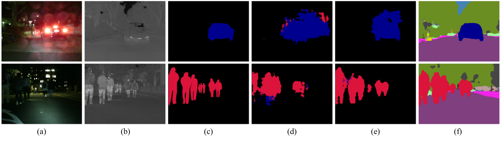

# Semantic-Segmatation

## Requirements

- PyTorch 1.3 to 1.6

## Dataset

### <UTokyo 멀티스펙트럴 데이터셋>
- 도심지에서 낮과 밤 시간대에 촬영된 데이터 셋으로 쌍을 이루는 칼라영상과 열화상 영상을 제공함. 픽셀 단위의 시맨틱 라벨 정보를 제공하고 있어 시맨틱 정보 추정 연구에 활용 됨.

- [데이터 셋 다운 홈페이지](https://www.mi.t.u-tokyo.ac.jp/static/projects/mil_multispectral/) 이곳에서 [Multi-spectral Semantic Segmentation Dataset (link to Google Drive)](https://drive.google.com/drive/folders/1YtEMiUC8sC0iL9rONNv96n5jWuIsWrVY) 이 링크를 통해서 Dataset을  현재 경로 다운 받아야한다.

- UTokyo Dataset은 칼라영상과 열화상영상을 합쳐서 4채널로 제공은 한다. 따라서 두 도메인의 영상을 따로 다루기 편하도록 칼라와 열화상으로 따로 저장하는 작업이 필요하다.
  - ```Make_split.ipynb```을 이용해 RGB 와 Thermal 를 분리해 저장해야한다. 


## Dataloader


- 데이터 폴더 구조 :
```
data
├── ir_seg_dataset
│   ├── images
│   │   ├── 00001D.png
│   │   ├── 00003N.png
│   │   ├── 00006N.png
│   │   └── ...
│   ├── labels
│   │   ├── 00001D.png
│   │   ├── 00003N.png
│   │   ├── 00006N.png
│   │   └── ...
│   └── ...
├── models
├── output

```

## Train && Test 

### Model (MS-UDA)
-  시맨틱 정보 추출 기술의 베이스라인으로 선정된 모델은 칼라 영상을 입력으로 하는 시맨틱 정보 추정 모델의 정확성을 열화상 영상 기반의 모델에 전이 시켜주기 위한 Multi-Spectral Domain Adaptation 개념과 낮과 밤에 온도 차이로 인해 서로 다른 정보를 포함하는 열화상 카메라의 문제를 해결하기 위한 Day-to-Night Thermal Image Translation 개념을 도입해서 낮과 밤에 상관없이 고정확도의 시맨틱 정보를 추정함.  

### 학습 및 평가 방식 
- 학습과 평가는 코드 하나로 한번에 진행된다.
   ```
   python train.py
   ``` 

## Result

### 정량적 평가
- 추정된 시맨틱 정보의 성능 평가를 위해 성능평가지표(evaluation metric)로 mIoU를 사용하였음 
- 입력 영상에 따른 시맨틱 정보 추정 모델의 성능을 측정하기 위해 열화상 영상과 칼라 영상을 각각 시맨틱 추정 모델의 입력으로 사용하여 추정된 시맨틱 정보의 정확도를 분석함. 아래 결과를 통해 낮과 밤 모든 시간대에서 1차년도 대비 약 20% 성능 향상을 확인할 수 있음. 
| 방법론 | 영상 | mIoU |
| :-----:|:-----: |:-----: |
|   OCR  | 열화상 |46.4 |
|   OCR  |  칼라 | 42.5  |
|   MS-UDA  | 열화상 | 67.8 |
|   MS-UDA  |  칼라 | 67.8  |

(표 1) 낮+밤 에서 정량적 성능평가


### 정성적 평가
- 정성적 결과인 (d)-(f) 3열을 (c) 정답 시맨틱 정보와 비교해보면, 광량이 부족한 밤 시간대에 열화상 영상을 입력으로 했을 경우 정답과 유사하도록 추정하지만 칼라 영상을 입력으로 했을 때는 시맨틱 정보를 추정하지 못하는 것을 확인할 수 있음. 이는 열화상 영상이 전장 환경의 이해를 돕기 위한 기술의 중요한 센서임을 시사함. 
- 또한, 열화상 영상을 입력으로 한 (e)와 (f)를 비교해 보면, 칼라 카메라의 결과를 추가적으로 사용한 베이스라인 방법론(f)에서 더욱 정밀하고 명확한 시맨틱 정보를 예측한 것을 확인할 수 있음.


(그림 1) 칼라카메라 정보를 활용한 시맨틱 정보 추출 모델 정성적 평가 결과, (a) 칼라 영상, (b) 열화상 영상, (c) 정답 시맨틱 정보, (d) 비교모델에 칼라 영상을 입력으로한 결과, (e) 비교 모델에 열화상 영상을 입력으로 한 결과, (f) MS-UDA 모델에 열화상 영상을 입력으로 한 결과를 나타냄. 
